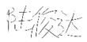
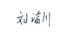
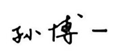
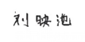

# AI 协作契约

#### 团队名称：第67组

#### 日期：2026年4月13日

**第一条：AI 使用原则**
- AI 是工具，工程师是责任主体
- 所有 AI 输出必须经过人工审查后才能合入项目

**第二条：AI 使用范围**
- 允许使用 AI 的场景：补充调研工作的需求分析；已经有明确且详细的功能设计和足够上下文的代码部分可以先使用AI生成示例；有资料依据的项目文档编写；代码正确性检查和代码风格优化；基于已有接口文档或代码逻辑生成单元测试；对现有代码生成结构优化和性能改进建议；为复杂逻辑代码注释；基于SQL数据表结构生成简单的标准查询语句；生成 .gitignore、CI/CD 等配置文件模板；
- 禁止直接使用 AI 输出（需额外审查）的场景：复杂SQL查询语句生成；已经有明确且详细的功能设计和足够上下文的代码部分使用AI补全；有资料依据的项目文档编写；代码正确性检查和代码风格优化；基于已有接口文档或代码逻辑生成单元测试；对现有代码生成结构优化和性能改进建议；为复杂逻辑代码注释；基于SQL数据表结构生成简单的标准查询语句；生成 .gitignore、CI/CD 等配置文件模板；
- 完全禁止使用 AI 的场景：涉及用户认证、密码校验等敏感信息的代码；核心业务逻辑代码实现；没有任何具体功能设计的未完成模块的代码编写

**第三条：过程记录要求**
- 所有与 AI 的交互 Prompt 必须保留日志
- Git commit message 必须标注 [AI-assisted] 或 [Human-written]
- 每阶段填写《AI 协作反思日志》

**第四条：代码合入规则**
- AI 生成的代码必须通过至少一名团队成员的 Code Review
- 每位成员每个编码阶段至少有 2 个完全手写的核心函数

**第五条：违约处理**
- 团队内部约定的违约处理方式： 如果成员违约情况不严重（触犯了第三条规则），该成员需要在下一次任务中承担更多工作并且被其他人监督；如果违约情况严重（触发第一、二、四条规则），该成员需要整改自己在违规情况下已完成任务并在其他人监督下承担下一次任务中大多数工作；如果违约情况非常严重（触发了第一、二、四条规则，并且同时触犯多条规则），在违约情况严重的处理下，并且在惩罚结束前禁止使用AI。

全体成员签名：
