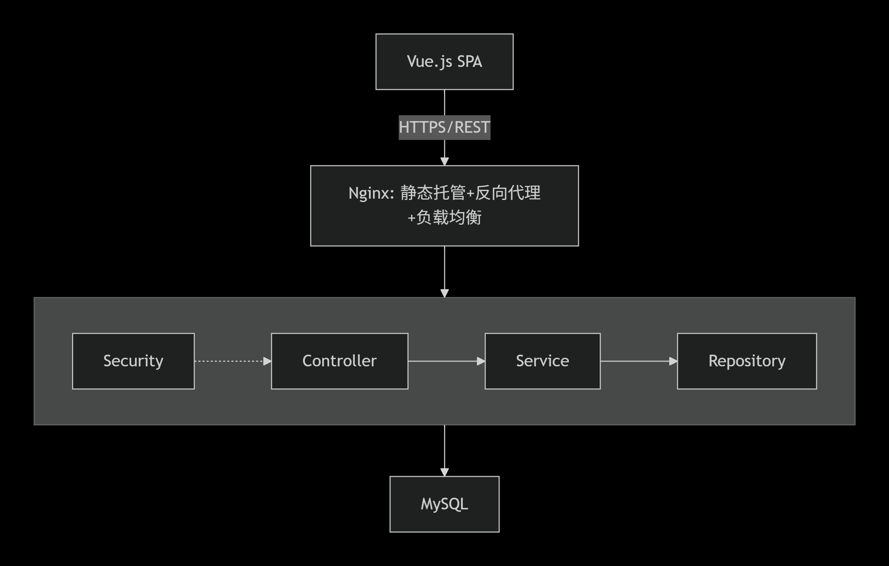
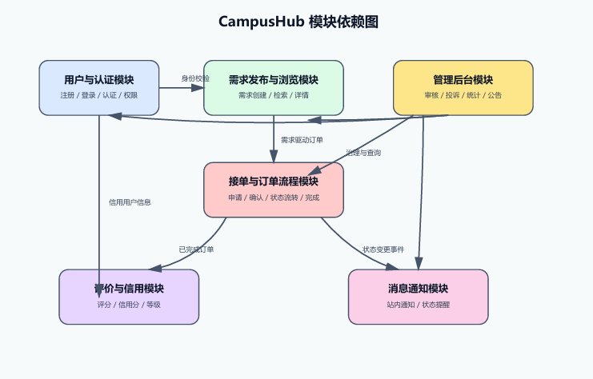

# 架构设计文档

### 团队：第67组 日期：2026/5/2

## 1. 架构概览

**架构图**


### 架构概述

这是一个典型的**前后端分离**的分层Web应用架构，采用**自上而下的分层设计**。前端独立部署，后端以单体应用形式提供API服务，各层之间有明确的职责边界和依赖方向（上层依赖下层）。

#### 前端层：Vue.js

前端层负责**用户界面渲染**和**交互逻辑处理**。

该层采用单页面应用架构模式。浏览器加载后，Vue.js在客户端执行JavaScript代码，动态渲染页面内容。页面切换不触发完整的页面重载，仅通过路由机制替换视图组件，配合AJAX异步请求获取数据并局部更新DOM。

前端层与后端的通信方式为HTTPS协议上的RESTful API调用。前端不直接访问数据库，所有数据变更和查询均通过API请求发送至后端。


#### 接入层：Nginx

接入层承担**流量入口**和**反向代理**双重职责，位于客户端与后端服务器之间。

其主要功能包括：

- **静态资源托管**：Vue.js构建产出的HTML、CSS、JavaScript文件由Nginx直接提供服务，无需经过后端应用服务器。

- **反向代理**：将发往特定路径的API请求转发至后端的Spring Boot应用实例。客户端感知的是统一的Nginx地址，后端服务的具体地址和端口被隐藏。

- **跨域处理**：由于前端和后端可能部署在不同端口或域名下，Nginx通过统一入口抹平这种差异，避免在前端或后端分别处理CORS问题。

- **负载均衡**：当后端存在多个Spring Boot实例时，Nginx基于预设策略将请求分发至不同实例，实现水平扩展。

#### 应用层：Spring Boot单体后端

应用层是核心业务逻辑的执行场所，采用**分层架构**模式，内部进一步划分为四个子层。
- Controller层（表示层）

该层作为HTTP请求的**入口适配器**，负责将外部HTTP协议转换为内部方法调用。
其职责包括：接收并解析HTTP请求参数、执行基础的格式与必填项校验（如字段非空、类型转换）、调用Service层暴露的业务方法、将Service层返回的领域对象序列化为JSON格式的HTTP响应。
Controller层不应包含任何业务逻辑，仅做协议转换和参数适配。
- Service层（业务逻辑层）

该层封装了应用程序的**核心业务规则**和**用例流程**。
每个Service方法对应一个完整的业务操作。在该层中执行的操作包括：多个Repository操作的协调与事务管理、条件判断与分支逻辑、业务规则校验（如库存是否充足、状态是否允许变更）、计算与推导（如信用分更新算法、价格计算）、以及其他非数据访问的纯逻辑处理。
Service层是事务边界的声明位置。该层不直接操作数据库，而是通过调用Repository层接口完成数据持久化。

- Repository层（数据访问层）

该层封装了与数据存储介质之间的**所有交互细节**。
其职责包括：将面向对象的领域对象与数据库表记录之间进行映射、构造SQL语句或使用ORM方法生成查询、执行CRUD操作、以及封装数据源访问异常。
Repository层的主要价值在于隔离Service层与底层数据库实现。当数据库类型或访问方式发生变化时，仅需修改该层代码，上层Service层保持不变。

- Security层（安全层）

该层贯穿或前置作用于其他层，负责**身份认证**与**访问授权**。
身份认证：验证请求发起者的身份合法性，通常通过解析HTTP请求中的Token（JWT）或Session凭证完成。
访问授权：在认证通过后，判断已认证的主体是否具备执行目标操作或访问目标资源的权限。


#### 数据层：MySQL

数据层是架构的**持久化存储底座**，负责数据的可靠保存与高效检索。MySQL作为关系型数据库管理系统，以二维表的形式存储结构化数据。该层存储用户账户信息、订单记录、需求详情等核心业务数据，支持ACID事务特性以确保数据一致性。应用层通过数据库连接池与MySQL建立连接，执行查询语句并处理返回的结果集。数据层不包含任何业务逻辑，仅提供数据的持久化存储与检索能力。


#### 各层间的依赖关系
该架构遵循**严格分层**的依赖原则：上层可以依赖直接下层，反之则不允许。

- 前端层依赖接入层（通过HTTPS请求）
- 接入层依赖应用层（通过反向代理转发）
- Controller层依赖Service层
- Service层依赖Repository层和Security层
- Repository层依赖数据层（MySQL）

依赖方向始终**自上而下**，从用户界面指向数据存储，形成单向依赖链。这保证了架构的清晰性：修改数据层实现不影响Service层，修改Service层业务逻辑不影响Controller层。


## 2. 模块划分

### 模块职责
- 用户与认证模块<br>负责用户注册、登录、身份认证、个人资料维护和角色信息管理。为其他业务模块提供统一的用户身份与权限基础。前端通过 RESTful API 提交登录、注册、资料修改请求，后端返回用户基本信息、登录结果和权限判断结果。

- 需求发布与浏览模块<br>负责互助需求的创建、编辑、删除、分类、检索和详情展示。管理需求的标题、描述、分类、时间、地点和状态等基本属性。前端提交需求内容与筛选条件，后端返回需求列表、分页结果和需求详情。

- 接单与订单流程模块<br>负责服务方申请接单、需求方确认、任务状态流转、完成确认和订单历史记录。管理订单从“申请”到“完成”的完整业务过程。前端提交接单申请、确认请求和状态更新请求，后端返回订单状态、处理结果和历史记录。

- 评价与信用模块<br>负责订单完成后的双向评价、评分记录、信用分计算与展示。为平台的信任机制提供基础数据支撑。前端提交评分与文字评价，后端返回信用分、信用等级和评价结果。

- 消息通知模块<br>负责接单通知、状态变更通知、评价通知等站内消息提醒。支撑用户及时获取与自己相关的业务变化。由订单、评价等业务事件触发通知生成，前端查询通知列表、未读状态和消息详情。

- 管理后台模块<br>负责违规需求审核、投诉处理、用户封禁、公告发布和统计查看。支持管理员进行平台治理与运营管理。管理员通过后台接口执行审核和管理操作，后端返回处理结果、统计数据和审查记录。

### 依赖关系


- 接单与订单流程模块依赖用户与认证模块、需求发布与浏览模块。
- 评价与信用模块依赖接单与订单流程模块、用户与认证模块。
- 消息通知模块依赖订单流程和评价流程产生的业务事件。
- 管理后台模块可访问用户、需求、订单、评价等核心业务数据。

### 模块间接口

**模块间调用方式**

- 前后端之间统一采用 RESTful API，数据交换格式为 JSON。
- 后端内部模块之间主要通过 Service 层调用协作完成业务流程。
- 当前阶段通知功能优先采用同步调用方式实现，以降低复杂度。
- 若后续业务量增长，可以再将通知、推荐等功能逐步扩展为异步处理机制。


*下表描述的是体系结构设计阶段定义的核心模块间接口。由于当前仓库仍处于早期实现阶段，接口以逻辑边界和调用约定为主，后续可映射为具体 RESTful API 与 Service 方法。*


| 调用方模块 | 被调用方模块 | 接口名称 | 调用方式 | 输入数据 | 输出数据 |
|---|---|---|---|---|---|
| 需求发布与浏览模块 | 用户认证模块 | 用户身份校验接口 | Service / REST | 用户ID、登录态令牌 | 用户身份信息、权限结果 |
| 接单与订单流程模块 | 用户认证模块 | 接单用户校验接口 | Service / REST | 用户ID、角色信息 | 用户是否有接单权限 |
| 接单与订单流程模块 | 需求发布与浏览模块 | 需求详情查询接口 | Service / REST | 需求ID | 需求标题、发布者、状态、时间地点等 |
| 接单与订单流程模块 | 消息通知模块 | 订单状态通知接口 | Service 事件调用 | 订单ID、状态、接收人ID | 通知发送结果 |
| 评价与信用模块 | 接单与订单流程模块 | 已完成订单查询接口 | Service / REST | 订单ID、评价人ID | 订单是否完成、评价资格 |
| 评价与信用模块 | 用户认证模块 | 用户信用信息更新接口 | Service | 用户ID、评分结果 | 最新信用分、信用等级 |
| 消息通知模块 | 用户认证模块 | 通知接收人查询接口 | Service | 用户ID | 接收人基础信息 |
| 管理后台模块 | 用户认证模块 | 用户封禁与角色管理接口 | REST / Service | 管理员ID、目标用户ID、操作类型 | 处理结果、最新用户状态 |
| 管理后台模块 | 需求发布与浏览模块 | 需求审核与下架接口 | REST / Service | 需求ID、审核意见 | 审核结果、需求状态 |
| 管理后台模块 | 接单与订单流程模块 | 纠纷订单查询接口 | REST / Service | 订单ID、筛选条件 | 订单详情、处理记录 |
| 管理后台模块 | 评价与信用模块 | 评价记录查询接口 | REST / Service | 用户ID、订单ID | 评价内容、信用变更记录 |

**前后端主要接口分组**
- /api/auth/*：用于注册、登录、登出、用户身份校验。
- /api/requests/*：用于需求发布、编辑、删除、列表筛选、详情查看。
- /api/orders/*：用于接单申请、订单确认、状态流转、历史记录查询。
- /api/reviews/*：用于提交评价、查询评价、计算与展示信用结果。
- /api/notifications/*：用于查询站内通知、未读状态和消息详情。
- /api/admin/*：用于后台审核、投诉处理、用户管理和统计数据查看。


---

## 3. 技术选型

| 层次 | 选择 | 选择理由 |
|------|------|---------|
| 前端框架 | Vue + js | 1. 学习门槛低，上手极快，与React对比，React需要理解JSX、Hooks 规则、useCallback/useMemo等概念实现状态的刷新，学习曲线更陡。 2. 开发效率高，单文件组件形式：一个 .vue 文件里，template（结构）+ script（逻辑）+ style（样式）都在一起。写一个页面或组件时，不用在多个文件之间来回切换，有利于思路集中。  3.生态成熟，遇到问题容易解决，中文文档非常完善，社区问答（如 SegmentFault、Vue 中文论坛、各种技术博客）也很丰富。遇到报错，基本都能在网络上找到解决方案。   5.团队协作友好，风格统一，.vue 文件的结构（template/script/style 分区）让组件代码一目了然。不同人写的组件也能比较清晰的被理解。|
| 后端框架 | SpringBoot |1. 配置简单，快速启动，添加一个依赖时会自动配置好嵌入的Tomcat、Spring MVC等。  2.强大的生态与社区，大部分后端需求，都有对应的Spring项目或第三方库可以无缝整合。    3. 对象管理方便，Spring 的核心是 IoC（控制反转） 容器。你不需要自己手动 new 对象，只需在类上加上 @Service 或 @Component 注解，Spring会自动创建和管理这些对象的生命周期。    4. 稳定性高，Spring Boot性能与稳定性背靠 Java，虽然启动比 Node.js 慢，但运行时性能非常出色。得益于 JIT（即时编译）技术，长期运行的稳定服务性能极高，非常适合高并发、计算密集型的场景。|
| 数据库 | MySQL |  1.与 Java/Spring Boot 生态完美融合。Spring Boot 对 MySQL 的支持是最好的，几乎没有之一。无论是用 Spring Data JPA、MyBatis 还是 MyBatis-Plus，都与 MySQL 完美适配，出现问题也能很方便地找到解决方案。 2.性能与稳定性高。MySQL 的默认存储引擎 InnoDB，在设计上对读取操作非常友好，读取性能优秀。大部分业务场景都是读多写少，正好能发挥 MySQL 的优势。并且MySQL 被全球数百万个网站使用（包括 Facebook、Twitter 早期），经过了十几年的真实场景考验，稳定性非常高。   3.简单易用。SQL 标准支持好：MySQL 的 SQL 语法非常接近标准 SQL，学习成本低。不像 PostgreSQL 有更多高级语法但相对复杂，也不像 SQL Server 有独特方言；管理工具成熟：Navicat、DBeaver、DataGrip 等都完美支持 MySQL，管理数据库非常方便。|
| 中间件1 |  Spring Security +CorsFilter    |    1. 这是 Spring Security 官方推荐的方案，CorsFilter 是 Spring Security 专门为处理 CORS 提供的标准组件，遵循 Servlet 规范。用它而不是自己写 @WebFilter，意味着代码符合框架设计，更容易被理解和维护。   2.实现了安全策略的统一配置和集中管理，一处配置，全局生效。可以在 Spring Security 的配置类（SecurityFilterChain）中，用几行代码（http.cors()）就开启 CORS 支持。将所有安全相关的配置都集中在一个地方。   3.开发环境友好，CorsFilter 在开发时就能生效。你在本地启动 Vue 和 Spring Boot（不同端口），不需要配置 Nginx，也能正常调试。|
| 中间件2 |  Spring Security + UsernamePasswordAuthenticationFilter   |   1. 与 Spring Security 生态完美集成,UsernamePasswordAuthenticationFilter 不是孤立的，它是整个认证体系的一环。  2.灵活可扩展，适应各种场景。UsernamePasswordAuthenticationFilter 被设计成高度可定制的，让你不必自己处理那些复杂、容易出错的安全细节，而是专注于业务逻辑。|
| 部署方式                                      |  用 Nginx 托管 Vue 前端、对后端 API 进行反向代理    |    1. 解决跨域问题，开发时Vue在localhost:8080，Spring Boot在localhost:8081，浏览器会因端口不同拦截请求；在部署后，浏览器只需要访问Nginx的80或443端口（同一个域名和端口）。Nginx根据路径（例如/api/）将请求转发给后端。对浏览器而言，所有请求都指向同一个“源头”，没有跨域问题，避免了配置复杂的CORS策略。    2. 提升性能，Nginx能够极速处理静态文件：Nginx专门为高效分发静态文件（HTML/CSS/JS/图片）而设计，比用Spring Boot的static目录托管快得多（内存占用更低，并发能力高数倍）。  3. 提升并发处理能力延展性，当用户量增长后，可以通过启动多个Spring Boot实例，并在Nginx中配置upstream即可将请求分发到这些实例上，分摊压力，实现高可用。   4. 提升安全性隐藏后端细节：用户只看到Nginx的地址，无法直接探测到你的Spring Boot服务地址和端口。    5. 简化部署和运维部署更清晰：前端打包为静态文件，后端打包为JAR包，两者解耦，可以独立更新互不影响。并且如果以后增加其他后端服务（如Python、Go服务），只需要在Nginx里增加一条转发规则即可，前端代码无需任何改动。|

## 4. ADR集合

### 4.1 ADR-001

```md
# ADR-001：采用分层单体架构以优先保障10周内可交付的MVP
## 状态
待讨论
## 背景
CampusHub 是一个高校校园互助平台，学生可以发布任务（快递代取、拼单等）、接单、完成订单后双向互评。项目由4名软件架构经验尚浅的学生开发者组成的团队负责，总周期仅10周，必须交付具备注册登录、需求发布与浏览、接单、订单状态流转等 Must Have 功能的 MVP。非功能需求包括支撑500人同时在线、核心 API 响应时间低于2秒，保护学生隐私（不强制实名，支持匿名发布与评价），以及集成敏感词内容审核。Should Have 功能如表单的匿名选项、评价信用、基础论坛、站内通知等将在 MVP 交付后视进度考虑，而即时通讯、智能推荐、复杂信用模型等明确列为 Won't Have。
在此约束下，团队需要从架构风格上做出根本性决策，以平衡10周内的交付可行性与未来的可维护性及可扩展性。核心的架构分歧点在于：是应选择开发上手的单体架构，还是追求长期可扩展性的微服务架构。
## 决策
我们决定采用 分层单体架构（Layered Monolith），以模块化的后端单体应用承载所有核心业务能力，前端使用 Vue.js 构建单页应用，整体通过 Docker 容器化部署。后端将严格按照表现层（API）、业务逻辑层（领域服务）和数据访问层（仓库）进行垂直分层，并按功能领域（用户、任务、订单、评价、论坛、通知等）进行水平模块划分。
## 理由
1.	最大化10周内交付的可行性，放弃微服务带来的分布式复杂性
在4人团队且经验尚浅的前提下，微服务架构需要掌握服务发现、负载均衡、分布式事务、跨服务通信（REST/gRPC）、合约测试、分布式日志与追踪等多重技能，学习曲线陡峭，会严重挤占功能开发时间。分层单体架构只需依赖 Flask/Django 内置的请求-响应机制和单一数据库，团队成员现有的 Python + Vue + Docker 经验即可覆盖全部开发与部署工作，从而将有限的时间聚焦在实现核心业务逻辑上。我们放弃了微服务带来的独立部署与独立演进的收益，换取了极短的开发启动耗时和确定的交付节奏。
2.	降低集成与运维的认知负荷，保障 MVP 稳定性
微服务架构意味着需要处理多服务间的部分失败、超时重试、最终一致性等棘手问题，还要搭建和维护 CI/CD 流水线、容器编排（如 Docker Compose 过渡到 Kubernetes）等基础设施。对于一个仅需支撑500并发、核心 API 响应 <2 秒的系统而言，这些复杂性在当前阶段属于过度设计。单体应用通过单进程部署和 Docker 容器化，即可用极低的运维成本满足性能目标，并能利用 Gunicorn 等 WSGI 服务器水平扩展进程数。我们放弃了微服务的细粒度弹性伸缩能力，但在 MVP 阶段几乎不会有这种需求，等到需要时再评估拆分远比提前引入分布式代价更低。
3.	通过严格的模块化设计为未来演进留出空间，避免向下牺牲长期可维护性
直接选择单体架构的风险在于日后可能成长为“大泥球”，难以维护和扩展。为弥补这一牺牲，我们在分层单体内强制执行功能模块边界：每个功能领域（如 users、tasks、orders、reviews、forum、notifications）拥有独立的服务、仓库和 API 资源，模块间通过定义好的接口（如 Python 的抽象基类或明确的函数签名）通信，严禁跨模块直接访问数据表。这种松耦合的模块化单体既可以维持快速的开发反馈循环，又使得未来若某模块（例如内容审核、站内通知）需要独立伸缩或重写时，可以相对平滑地抽离为独立的微服务，而不必重写整个系统。我们并没有放弃长期可扩展性，而是将其推迟到实际需要并拥有更多工程资源时再实现，当前以严格的架构约束作为折衷。
## 后果
- 正面影响：
1.开发、构建、测试和部署流程极简，4人团队可在10周内集中精力交付完整的核心功能闭环。
2.单一代码库和共享数据库降低了调试和问题定位的难度，利于经验尚浅的团队快速学习与协作。
3.Docker 化单体部署模式即可满足 MVP 的并发与延迟要求，无需额外的基础设施投资。
4.预先定义的模块边界与接口规则从源头抑制耦合，即使不拆分，代码库也具备较高的可读性与可维护性。
- 负面影响：
1.随着功能迭代，若模块间接口纪律松弛，代码库仍存在耦合蔓延、成为大泥球的潜在风险。
2.未来若某一模块（如论坛或通知）负载显著增长，无法单独扩缩容，必须整体扩展整个应用实例，资源利用不够精细。
3.持续交付的效率会随代码库膨胀而下降，全量构建和测试的时间将逐渐变长。
- 需要关注的风险：
1.团队可能因进度压力而打破模块边界，需要从首日起建立代码审查、架构约束检查（如用 linter 或架构测试工具约束导入方向）等实践来持分与模块化的完整性。
2.若 MVP 校园上线后用户量或功能需求爆发式增长，可能出现性能瓶颈或模块耦合导致的迭代速度骤降。缓解措施是持续监控核心 API 的响应时间与模块间的耦合度，将“可拆分性”作为非功能性指标纳入代码评审，一旦某些指标逼近阈值，优先将该模块剥离为独立服务。
3.Django 的 “apps” 或 Flask 蓝图天然支持模块化划分，应充分利用这些机制，将每个功能领域实现为可独立替换的组件，降低未来迁移成本。

# 人工修订后ADR

用 ~~删除~~ 和 **新增** 标记出修订差异的版本。
# ADR-001：采用分层单体架构以优先保障10周内可交付的MVP

## 状态
待讨论

## 背景
CampusHub 是一个高校校园互助平台~~，学生可以发布任务、接单、完成订单后互评。~~ **学生可发布任务（快递代取、拼单等）、接单、完成订单后双向互评。** 项目由4名软件架构经验尚浅的学生开发者组成的团队负责，总周期仅10周，必须交付具备注册登录、需求发布与浏览、接单、订单状态流转等 Must Have 功能的 MVP。**非功能需求包括支撑500人同时在线、核心 API 响应时间低于2秒，保护学生隐私（不强制实名，支持匿名发布与评价），以及集成敏感词内容审核。** Should Have 功能如表单的匿名选项、评价信用、基础论坛、站内通知等将在 MVP 交付后视进度考虑，而即时通讯、智能推荐、复杂信用模型等明确列为 Won't Have。

在此约束下，团队需要从架构风格上做出根本性决策，以平衡10周内的交付可行性与未来的可维护性及可扩展性。核心的架构分歧点在于：是应选择开发上手的单体架构，还是追求长期可扩展性的微服务架构。

## 决策
我们决定采用 **分层单体架构（Layered Monolith）**，~~后端使用 Python（Flask/Django）构建单体应用，前端使用 Vue.js~~ **以模块化的后端单体应用承载所有核心业务能力，前端使用 Vue.js 构建单页应用，整体通过 Docker 容器化部署。后端将严格按照表现层（API）、业务逻辑层（领域服务）和数据访问层（仓库）进行垂直分层，并按功能领域（用户、任务、订单、评价、论坛、通知等）进行水平模块划分。**

## 理由
~~1. 开发简单，团队熟悉 Python 和 Vue，能快速启动。~~
~~2. 单体应用部署容易，不需要服务发现等复杂基础设施。~~
~~3. 未来可以拆分为微服务。~~
**1. 最大化10周内交付的可行性，放弃微服务带来的分布式复杂性**
在4人团队且经验尚浅的前提下，微服务架构需要掌握服务发现、负载均衡、分布式事务、跨服务通信（REST/gRPC）、合约测试、分布式日志与追踪等多重技能，学习曲线陡峭，会严重挤占功能开发时间。分层单体架构只需依赖 Flask/Django 内置的请求-响应机制和单一数据库，团队成员现有的 Python + Vue + Docker 经验即可覆盖全部开发与部署工作，从而将有限的时间聚焦在实现核心业务逻辑上。我们放弃了微服务带来的独立部署与独立演进的收益，换取了极短的开发启动耗时和确定的交付节奏。

**2. 降低集成与运维的认知负荷，保障 MVP 稳定性**
微服务架构意味着需要处理多服务间的部分失败、超时重试、最终一致性等棘手问题，还要搭建和维护 CI/CD 流水线、容器编排（如 Docker Compose 过渡到 Kubernetes）等基础设施。对于一个仅需支撑500并发、核心 API 响应 <2 秒的系统而言，这些复杂性在当前阶段属于过度设计。单体应用通过单进程部署和 Docker 容器化，即可用极低的运维成本满足性能目标，并能利用 Gunicorn 等 WSGI 服务器水平扩展进程数。我们放弃了微服务的细粒度弹性伸缩能力，但在 MVP 阶段几乎不会有这种需求，等到需要时再评估拆分远比提前引入分布式代价更低。

**3. 通过严格的模块化设计为未来演进留出空间，避免向下牺牲长期可维护性**
直接选择单体架构的风险在于日后可能成长为“大泥球”，难以维护和扩展。为弥补这一牺牲，我们在分层单体内强制执行功能模块边界：每个功能领域（如 users、tasks、orders、reviews、forum、notifications）拥有独立的服务、仓库和 API 资源，模块间通过定义好的接口（如 Python 的抽象基类或明确的函数签名）通信，严禁跨模块直接访问数据表。这种松耦合的模块化单体既可以维持快速的开发反馈循环，又使得未来若某模块（例如内容审核、站内通知）需要独立伸缩或重写时，可以相对平滑地抽离为独立的微服务，而不必重写整个系统。我们并没有放弃长期可扩展性，而是将其推迟到实际需要并拥有更多工程资源时再实现，当前以严格的架构约束作为折衷。**

## 后果
- 正面影响：~~开发速度快，部署简单。~~
  **1. 开发、构建、测试和部署流程极简，4人团队可在10周内集中精力交付完整的核心功能闭环。**
  **2. 单一代码库和共享数据库降低了调试和问题定位的难度，利于经验尚浅的团队快速学习与协作。**
  **3. Docker 化单体部署模式即可满足 MVP 的并发与延迟要求，无需额外的基础设施投资。**
  **4. 预先定义的模块边界与接口规则从源头抑制耦合，即使不拆分，代码库也具备较高的可读性与可维护性。**

- 负面影响：~~可能变成大泥球。~~
  **1. 随着功能迭代，若模块间接口纪律松弛，代码库仍存在耦合蔓延、成为大泥球的潜在风险。**
  **2. 未来若某一模块（如论坛或通知）负载显著增长，无法单独扩缩容，必须整体扩展整个应用实例，资源利用不够精细。**
  **3. 持续交付的效率会随代码库膨胀而下降，全量构建和测试的时间将逐渐变长。**

- 需要关注的风险：~~注意保持模块边界。~~
  **1. 团队可能因进度压力而打破模块边界，需要从首日起建立代码审查、架构约束检查（如用 linter 或架构测试工具约束导入方向）等实践来维持分层与模块化的完整性。**
  **2. 若 MVP 校园上线后用户量或功能需求爆发式增长，可能出现性能瓶颈或模块耦合导致的迭代速度骤降。缓解措施是持续监控核心 API 的响应时间与模块间的耦合度，将“可拆分性”作为非功能性指标纳入代码评审，一旦某些指标逼近阈值，优先将该模块剥离为独立服务。**
  **3. Django 的 “apps” 或 Flask 蓝图天然支持模块化划分，应充分利用这些机制，将每个功能领域实现为可独立替换的组件，降低未来迁移成本。**

## AI 辅助记录
- AI 初稿内容摘要：
  建议采用分层单体架构，理由为开发简单、团队熟悉、可快速上线，未来可拆分为微服务。未具体分析10周约束与质量属性之间的权衡，也未给出模块化实施的严格方案。
- 人工修订内容：
1. 补充了500并发、敏感词审核、匿名等非功能约束的背景描述。
2. 将三条笼统理由替换为基于“10周交付可行性vs.长期可维护性”的详细权衡分析。
3. 明确了通过水平模块划分和接口纪律来补偿单体牺牲的可扩展性。
4. 详细列出了正面/负面影响及具体风险缓解措施。
- 修订理由：
  AI 初稿未体现该项目关键的质量属性权衡（交付速度 vs 可扩展性），只停留在常识性优点罗列，未给出可执行的模块化约束和风险应对策略。修订使其成为一条有记录价值的架构决策，真正指导团队在压缩周期内的设计纪律。


```


### 4.2 ADR-002

```md
# ADR-002：采用进程内轻量事件驱动处理非核心流程 
## 状态 
已接受 
## 背景 
我负责CampusHub校园互助平台的架构设计，结合项目约束（4人学生
团队、10周交付MVP、500人在线、核心接口响应<2秒），平台在订单状态变更、评
价完成、论坛发帖等场景下，需触发站内通知、信用分更新等非核心流程。若同步处
理会拉长核心接口响应时间，影响用户体验；若引入外部消息队列
（RabbitMQ/Kafka），会提升架构复杂度，超出团队能力且影响交付周期，需在性能、
解耦、复杂度之间权衡。 
## 决策 
我决定采用后端框架（Python Flask）内置的进程内轻量异步事件机制，处理站内通
知、信用分更新等非核心流程，不引入任何外部消息中间件，确保架构极简、可落地。 
## 理由 
- 适配项目约束：贴合10周交付目标，无需部署、配置外部消息队列，降低学习与
运维成本，适配4人学生团队能力，确保按时完成架构落地。 
- 保障核心体验：异步处理非核心流程，不阻塞发单、接单、确认完成等核心接口，
配合Redis缓存，可确保核心接口响应时间<2秒，满足性能要求。 
- 实现业务解耦：通知、信用分更新模块不侵入核心业务逻辑，符合单一职责原则，
便于后期维护与迭代，降低调试难度。 
- 适配业务规模：校园平台峰值 500 人在线，事件量较小，进程内异步完全可支撑，
无需复杂的事件持久化处理，简化开发流程。 
## 后果 
- 正面影响 
• 核心接口响应速度提升，保障用户使用体验，满足项目性能要求。 
• 架构复杂度低，开发、调试效率高，契合学生团队能力，确保按时交付。 
• 业务模块解耦，后期维护、功能迭代更便捷，降低出错概率。 
- 负面影响 
• 事件无持久化，应用重启可能丢失少量非核心通知（不影响核心业务）。 
• 不支持跨实例广播，但若未来扩展为分布式系统，需调整异步机制。 
- 风险控制 
• 严格区分核心与非核心流程，仅将通知、信用分更新等非核心操作纳入异步处理，
核心业务保持同步执行。 
• 规范异步事件编码规范，避免异步逻辑过多导致调试困难，做好日志记录便于问
题定位。 
## AI 辅助记录 
- AI 初稿摘要：建议引入RabbitMQ消息队列实现异步解耦，强调高可用性，未考虑学
生团队能力与10周交付周期，属于过度设计。 
- 人工修订：放弃外部消息队列，改为进程内轻量异步事件机制，明确适用场景与风险
控制，补充团队与周期适配性理由。 
- 修订理由：AI未结合项目实际约束（学生团队、短周期），盲目推荐重型方案，我结合
架构设计工作实际，修正为轻量化可落地方案，确保决策务实、可交付。
```
### 4.3 ADR-003

```md
# ADR-003：采用按业务模块划分的单体分层架构
## 状态
已接受
## 背景
CampusHub 需要在 10 周内完成一个可运行、可演示、可维护的校园互助平台。团队规模为 4 人，当前
技术基础为 Vue 前端与 Spring Boot 后端。系统包含用户、需求、订单、评价、通知、管理等功能，需要
在保证开发效率的同时维持清晰的职责边界。
## 决策
我们决定采用“前后端分离 + 后端单体分层 + 按业务模块组织代码”的架构方式。
## 理由
- 相比微服务，单体分层架构开发成本更低，更适合课程项目周期。
- 按业务模块组织代码，能够在不增加部署复杂度的前提下保持结构清晰。
- 该方案兼顾当前交付效率与后续一定程度的可扩展性。
- 团队成员对 Vue、Spring Boot、RESTful API 的学习和使用成本较低。

## 后果
- 正面影响：
开发与联调成本较低。
代码结构清晰，便于分工协作。
部署简单，适合课程项目推进。
- 负面影响：
当业务继续膨胀时，单体应用可能出现模块耦合上升的问题。
后续扩展性不如天然拆分的微服务架构。
- 风险控制：
如果模块边界定义不清，容易在 Service 层出现职责混杂。
需要通过包结构、接口定义和代码规范控制耦合。
## AI 辅助记录
- AI 初稿内容摘要
AI 建议在单体分层架构和微服务架构之间进行选择。
AI 指出微服务更有扩展性，而单体分层更适合小团队短周期项目。
- 人工修订内容
将“单体分层架构”进一步明确为“按业务模块划分的单体分层架构”。
补充强调模块边界与代码组织方式，而不仅仅停留在技术框架层面。
- 修订理由
AI 给出的建议较为概括，缺少对“如何在单体中保持模块清晰”的具体说明。
经过人工补充后，决策内容更符合当前项目的实际落地需要
```

